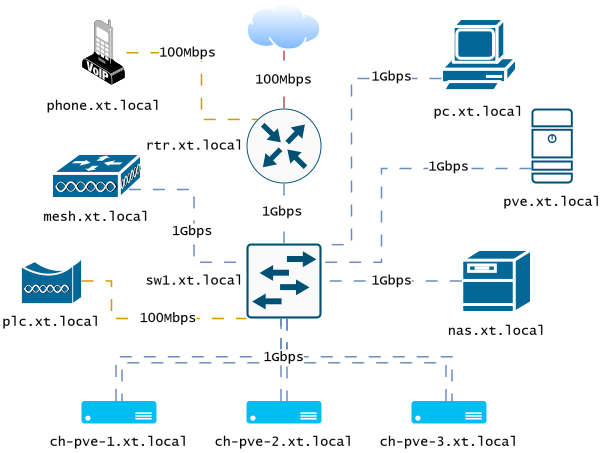

# homelab

Homelab `[hom-læb](n)`: a laboratory of (usually slightly outdated) awesome in the domicile

## Architecture

## Services index

* [Music streaming](stacks/music)

## Engineering notes

* [Docker swarm S3 shared volumes](engineering/docker-with-s3-shared-volumes.md)

## References

Highly inspired by:

* [Awesome Self-Hosted](https://github.com/awesome-selfhosted/awesome-selfhosted?ref=git.xtuxnet.com)
* [Awesome Sysadmin](https://github.com/awesome-foss/awesome-sysadmin?ref=git.xtuxnet.com)
* [Proxmox Helper Scripts](https://community-scripts.github.io/ProxmoxVE?ref=git.xtuxnet.com)
* [Portainer Templates](https://portainer-templates.as93.net?ref=git.xtuxnet.com)
